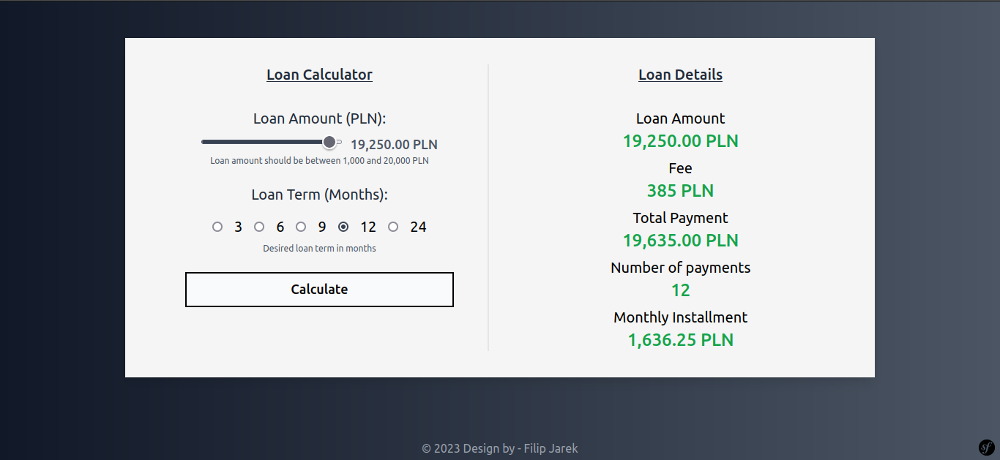
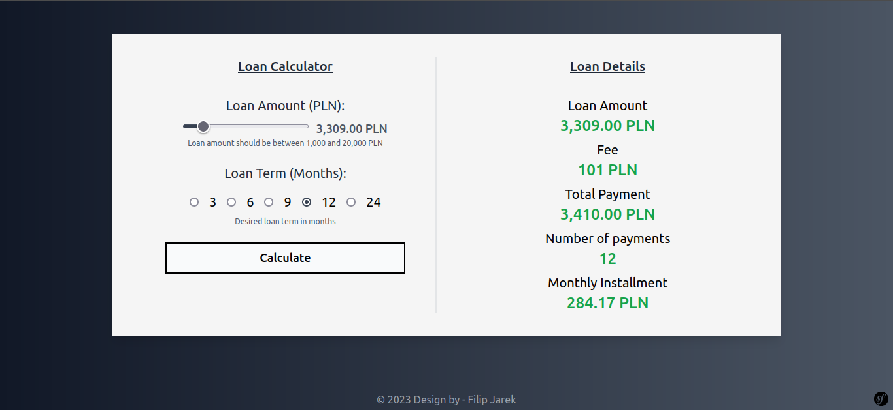

# Loan Fee Calculator 

## Table of Contents
* [Technologies Used](#technologies-used)
* [Fee Structure](#fee-structure)
* [Screenshots](#screenshots)
* [Setup](#setup)
* [Testing](#testing)

## Technologies Used

    Symfony 6.2.10
    PHP 8.2.0
    TailwindCSS 3.3.2
    Phpunit/phpunit 9.6.8
   
## Fee Structure
The fee structure doesn't follow particular algorithm and it is possible that same fee will be applicable for different amounts.
```
1000 PLN: 50 PLN
2000 PLN: 90 PLN
3000 PLN: 90 PLN
4000 PLN: 115 PLN
5000 PLN: 100 PLN
6000 PLN: 120 PLN
7000 PLN: 140 PLN
8000 PLN: 160 PLN
9000 PLN: 180 PLN
10000 PLN: 200 PLN
11000 PLN: 220 PLN
12000 PLN: 240 PLN
13000 PLN: 260 PLN
14000 PLN: 280 PLN
15000 PLN: 300 PLN
16000 PLN: 320 PLN
17000 PLN: 340 PLN
18000 PLN: 360 PLN
19000 PLN: 380 PLN
20000 PLN: 400 PLN
```
## Screenshots





## Setup
#### Step 1 : Clone the project
```
$ git clone https://github.com/filipjarek/task
```
#### Step 2 : Change current directory
```
$ cd task
```
#### Step 3 : Install dependencies
```
$ composer install
```
#### Step 4 : Run the project
```
$ symfony serve -d
```
Open link in your browser: http://localhost:8000:

## Testing
```
$ ./vendor/phpunit/phpunit/phpunit
$ php bin/phpunit
```
Run the tests using PHPUnit package
